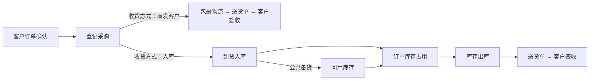

# 库存与两条履约路径

第一期把“平台采购直发客户”和“采购入库后发货”接在同一套料品编号和库存台账上，订单明细可以按数量自由组合两条路径。料品主数据集中在“产品库”维护，采购也可以只关联料品、不关联订单（公共备货）。

## 产品库与料品档案

“产品库”是料品主数据的维护入口，`items` 表保存料品编号（`LP` + 序号，可手工指定）、料品名称、标准型号、品牌、关键规格、库存单位、采购单位与换算系数、客户型号、供应商型号和启用状态。订单、采购、入库、出库都保存 `item_id`，不再依赖手写型号判断是否同一料品。

产品库列表同时显示每个料品的现存量、占用、可用、公共在途、加权成本、库存金额，以及被多少订单和采购明细引用；停用料品不参与新的匹配，历史单据和库存流水保留。“型号对应关系”记录客户或供应商文件里的不同写法（可自动记录，也可手工增删）。

匹配规则（`server/inventory.py`）：

1. 提交了料品编号或客户在订单里勾选料品 → 直接使用。
2. 客户型号／历史写法完全一致（忽略大小写、空格与 `-`、`_`、`/` 等分隔符）→ 认定为同一料品，并把新写法记入 `item_aliases`。
3. 名称 + 规格完全一致且品牌不冲突 → 认定为同一料品。
4. 多个候选 → 订单明细标记“待匹配料品”，在订单详情里人工选择。
5. 没有候选 → 自动建立新料品档案，编号统一。

首次录入时系统只做保守匹配；型号相同但材质、螺纹、尺寸等不能互换的，请在料品档案的“关键规格”里写明，必要时拆成不同料品编号。

## 数量口径

| 列 | 口径 |
| --- | --- |
| 现存量 | 仓库已入库、尚未出库的数量（`stock_balances` 汇总） |
| 已占用 | 已确认订单尚未出库的库存占用（`stock_reservations` 状态 `active`） |
| 可用库存 | 现存量 − 全部订单占用 |
| 入库在途 | 收货方式为“入库”、尚未入库且未处理的采购数量 |
| 本单在途 | 本订单关联的直发／入库采购尚未入库数量 |
| 公共备货在途 | 未关联任何订单的入库采购数量 |
| 预计可供量 | 可用库存 + 公共备货在途 |
| 本单缺口 | 需求 − 已发货 − 已落实（采购在途 + 本单库存占用） |

直发客户的采购只计入采购在途，不计入仓库现存量与公共在途。库存数量是实时参考值：登记占用、出库、入库撤销时服务端都会重新校验，避免两个订单同时分配同一批库存。

## 成本

入库时把该批成本计入 `stock_balances.value_cents`，出库时按移动加权平均结转，记入 `stock_outbound_lines.value_cents` 并累加到订单明细成本；直发采购仍按现有方式直接计入所关联订单成本。混合履约的订单成本由两部分相加。库存流水的每一笔都保留来源单据、数量和金额，撤销使用冲销记录，不覆盖历史。

## 操作指引

1. **产品库建档**：产品库 → 新增料品，填写料品编号、名称、标准型号、单位等；同一料品的不同客户/供应商写法维护在“型号对应关系”里。
2. **采购收货方式**：采购记录明细行选择“直发客户”或“入库”，入库可预先指定仓库。需要备货时点击“从产品库选择料品”，仅关联料品即可（不关联客户订单，收货方式固定为入库，采购成本按备货行填写）。
3. **登记入库**：库存 → 入库单 → 登记入库。选择“采购明细到货”（分批、库位、差异备注）或“无采购来源（公共备货）”。提前关联订单的入库数量会自动转为该订单的库存占用。
4. **库存占用**：订单详情 → 占用库存。占用只锁定可用库存，不扣减现存量；草稿订单不能占用。入库自动占用、人工占用都会显示在订单明细的“可用库存 / 预计可供量 / 本单缺口”列。
5. **安排出库**：订单详情 → 安排出库，或库存 → 出库单 → 安排出库。按料品编号校验，出库数量不能超过“已占用 + 可用库存”，提交后扣减库存、结转成本、释放占用并生成送货单（记为已发货）。
6. **更正**：出库需要更正时先撤销发货确认、作废送货单，再由管理员撤销出库单（库存和占用恢复）；入库单在货物尚未出库前可撤销。
7. **盘点**：库存总览选择料品 → 盘点，登记盘盈（含入库成本）或盘亏。

## 第二期候选

- 多仓调拨、库位与货架维护、条码扫描。
- 批次／序列号与保质期、先进先出出库策略。
- 补货预警与安全库存、采购建议。
- 客户退货直接回到可售库存或待检区，退供应商走库存出库。
- 料品合并／拆分、替代料品确认记录。
- 库存报表、库龄分析、成本调整单。
