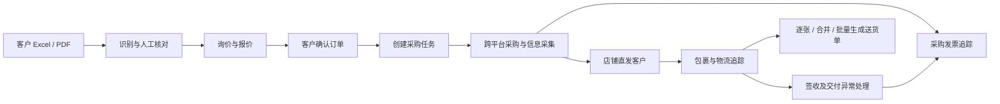

# 询价报价与跨平台采购管理系统——初步需求方案

版本：V0.1  
整理日期：2026-10-03  
状态：初步需求与实施建议，尚未进入开发及平台接入验证

## 1. 建设目标

建立一套以客户订单为主线的业务管理系统，贯通询价文件导入、报价、跨平台采购、店铺直发、物流追踪、送货单生成和采购发票追踪。

重点解决以下问题：

- 客户 Excel、PDF 格式不同，字段名称和内容不统一，人工整理工作量大。
- 采购分散在淘宝、京东、拼多多等平台，客户需求与采购订单难以对应。
- 一张客户订单涉及多个店铺、多个包裹，交付进度不易汇总。
- 采购价格、实付款、运费、退款和客户报价缺少统一核对。
- 送货单需要按客户需求分别、合并或批量生成。
- 采购发票容易漏申请、漏收取，缺少未开票查询和催票提醒。

## 2. 已确认的业务要求

以下内容来自用户明确说明或已选择的选项：

| 项目 | 已确认要求 |
| --- | --- |
| 订单来源 | 客户提供 Excel、PDF，样式不统一，内容不完全相同 |
| 业务流程 | 收到询价后报价，随后通过淘宝、京东、拼多多等平台采购 |
| 发货方式 | 店铺直接发给客户 |
| 料品基本内容 | 料品名称、料品规格、品牌、料品描述、数量 |
| 采购记录 | 记录平台订单号、订单信息、快递单号等，集中显示价格信息 |
| 送货单 | 支持按需逐张或一起生成；不显示单价、金额和客户签收栏 |
| 采购发票 | 可查询开票情况，追踪未开票采购并提醒 |
| 提醒渠道 | 系统内提醒 |
| 发票提醒起点 | 签收后 7 天，单笔采购可调整期限 |

本方案其余规则属于建议默认值；账号、接口权限及部分业务细节仍需验证或确认，见第 13 节。

## 3. 总体流程与系统形态

建议采用网页系统：电脑用于导入、报价、采购录入及打印，手机用于上传截图、查询订单和跟进异常。

店铺直发模式下，第一版无需建立你方仓库的收货、入库、出库流程。送货单开具、物流签收、客户确认货物无误分别记录。

## 4. 多格式客户订单导入

### 4.1 统一字段

| 层级 | 建议字段 |
| --- | --- |
| 订单表头 | 客户、客户 PO/询价单号、单据日期、期望交期、联系人、电话、收货地址、备注 |
| 料品明细 | 原始行号、客户料号（如有）、料品名称、料品规格、品牌、料品描述、数量、单位、行备注 |
| 原始资料 | 原文件、文件版本、导入时间、识别来源位置、核对状态 |

原文件中缺少的内容保留为空并标记，不推测填写。缺少品牌不等于允许任意品牌。客户料号和规格型号按文本保存，保留前导零等原始内容。

### 4.2 识别策略

| 文件类型 | 处理方式 |
| --- | --- |
| Excel | 直接读取单元格，识别表头、合并单元格、多工作表、明细区域 |
| 文字型 PDF | 提取文字和表格，再映射到统一字段 |
| 扫描 PDF / 图片 | OCR 识别，再用规则或 AI 整理字段 |
| 常见客户固定格式 | 优先使用已保存的字段映射和版式规则 |
| 新格式或含义不明确 | 自动生成草稿，标记待核对内容 |

示例：将“品名、物料名称、货物名称”映射为料品名称，将“型号、规格型号”映射为料品规格；品牌、客户料号、规格和描述分别保留。

### 4.3 核对与重复导入

- 左侧显示原文件，右侧显示识别结果；支持定位到原工作表单元格或 PDF 页面的对应内容。
- 核对数量、单位、规格、跨页明细，识别重复表头、合计行和遗漏行。
- 保存客户格式映射，下次导入同类文件时复用。
- 同一文件重复上传时提示；同一客户 PO 内容发生变化时展示差异，确认后形成新版本。
- 客户原始要求与实际采购规格分开保存，采购替代品不得覆盖原始要求。
- 源文档中的文字仅作为业务资料处理，不作为对系统或 AI 的操作指令。

识别准确性应以真实客户样本验证，当前不承诺任意格式完全自动识别。

## 5. 报价与价格管理

每项料品可维护采购参考价、客户报价、数量及相关运费、税费口径，汇总订单金额和预计利润。

建议区分：

| 价格类型 | 含义及处理 |
| --- | --- |
| 平台参考价 | 查询或采集时的商品价格，记录来源和时间 |
| 实际采购金额 | 实付款、运费、优惠、退款等实际采购记录 |
| 客户报价 | 向客户提供的价格，客户确认后锁定版本 |

“价格同步”建议第一版定义为：采购记录更新后，自动更新客户订单中的采购成本和利润汇总。全平台实时抓价取决于接口权限，不作为基础功能的前提。

同一采购订单含多项商品时，优惠和运费分摊后必须与订单实付总额一致。具体含税口径、分摊方式和利润计算方式在开发前确认。

## 6. 跨平台采购录入与关联

### 6.1 采集入口

所有入口汇入同一个采购台账。

| 入口 | 操作方式 | 适用情况及边界 |
| --- | --- | --- |
| 官方接口 | 按平台规则取得授权后同步订单 | 仅覆盖已获授权的账号、业务和字段 |
| 浏览器辅助采集 | 用户打开已登录的订单页面，点击采集，预览后保存 | 适合电脑采购，需逐平台验证页面及使用规则 |
| 截图识别 | 上传采购订单、物流或付款截图，识别后核对 | 适合手机采购和临时订单 |
| 粘贴文本 | 粘贴订单详情或店铺提供的信息，提取结构化字段 | 适合快速录入 |
| 文件导入 | 将平台可导出的订单文件导入系统 | 取决于平台账号实际提供的导出能力 |
| 手工录入 | 新建或补充采购记录 | 作为缺失字段和特殊订单的补充入口 |

浏览器辅助采集不等同于永久稳定的后台同步，需处理登录失效、页面变化和字段缺失。具体可采集范围必须用实际账号验证。

### 6.2 采购记录

建议保存：平台、采购账号标识、店铺、平台订单号、平台子订单号（如有）、商品链接、商品名称、所选规格、数量、单位、实付款、运费、优惠、退款、采购日期、承诺发货日期、收货地址、负责人、来源附件及最近同步时间。

商品链接仅作为参考，不代表实际购买规格或成交价。平台订单号按文本保存。重复采集同一平台、账号、订单及子订单时更新或提示，不重复生成采购数量和成本。

### 6.3 与客户订单关联

推荐操作顺序：

1. 在客户订单中勾选待采购料品及数量。
2. 创建采购任务，带入客户收货信息。
3. 在购物平台完成购买。
4. 导入或采集采购信息，与采购任务关联。
5. 核对规格、数量、金额及收货人后保存。

对于先采购后录入的订单，按规格、数量、收货人等推荐关联项，由操作人员确认。不能仅凭名称相似自动绑定。

支持一项客户料品分多次采购，以及一笔采购按数量分配给多个客户订单。若对应不同收货地址，必须明确各自实际包裹及数量，不默认一个包裹送往多个地址。

### 6.4 包装单位

保留采购单位与客户交付单位的换算关系。例如客户需求 30 个，平台规格为 10 个/包，则采购 3 包对应需求 30 个。数量关联、送货单和成本计算使用确认后的换算关系。

## 7. 购物平台自动接入的可行性

截至本方案整理日期，官方资料能确认的能力如下。以下为文档核实结果，尚未完成账号申请或实际调用测试。

| 平台 | 文档可确认能力 | 接入判断 |
| --- | --- | --- |
| 淘宝 | 企业购/采购宝有订单、包裹、物流轨迹和发票接口 | 可评估正式接入，需确认资格和订单覆盖范围 |
| 京东 | 企业采购 IOP 有订单、发票等接口；接入凭证由京东提供 | 获得对应采购接入资格后开展对接 |
| 拼多多 | 公开开放平台主要面向商家和服务商 | 本次未核实到普通买家读取全部已购订单的通用接口 |

商家销售订单接口不能直接视为买家采购订单接口。企业采购接口也不应默认覆盖普通 App 中的购买记录、历史订单或其他账号。

正式开发平台连接器前，验证：账号资格、可授权接口、可读取字段、历史订单范围、更新方式、调用限制、费用和授权有效期。

第一版应支持普通买家通过辅助采集和录入完成业务；后续接入官方接口时复用现有采购台账。

## 8. 包裹与物流追踪

### 8.1 独立追踪

物流能力独立于购物平台连接器。取得快递公司、运单号及必要验证信息后，可接入物流查询服务；快递100的官方文档提供订阅及状态推送方式，可作为候选方案。

部分承运商需要收寄件电话等验证信息。平台隐藏电话、虚拟号码、承运商不支持等情况，需要在实际单号验证中检查。

### 8.2 包裹关系

- 一笔采购可以对应多个包裹。
- 一个包裹可以包含多项料品，记录每项装包数量。
- 运单轨迹不提供可靠的包裹内料品信息，料品与包裹对应关系需由采购来源提供或人工确认。
- 每项客户料品汇总需求数量、已采购数量、已发货数量、已签收数量及已开送货单数量。
- 平台确认收货、物流签收、客户验收分别记录。

### 8.3 提醒与异常

| 事件 | 建议处理 |
| --- | --- |
| 超过承诺发货日期 | 催发货待办 |
| 已有单号但长时间未揽收 | 检查实际发货情况 |
| 在途长时间无更新 | 物流停滞待办 |
| 拒收、退回、派送异常 | 异常处理待办 |
| 查询失败或信息不足 | 展示失败原因、待补信息、最后成功更新时间 |
| 物流签收 | 更新对应包裹进度，并参与发票提醒计时 |

揽收、停滞等时间阈值在业务试用时确定，允许按实际情况调整。查询失败不能自动判断为未发货或已签收。

后台接收物流更新时应校验来源、防止重复处理，保留轨迹历史；同步失败进入重试及待处理列表。

## 9. 送货单

### 9.1 参考文件

用户提供的参考文件：`C:/Users/wangyh/Desktop/广州阿普顿送货单C3260922500007.xlsx`。

已读取的原模板包含公司信息、客户信息、客户 PO，以及序号、货物名称、规格型号、数量、单位、物流单号、备注，底部含签字及日期内容。附件仅作为格式参考；新模板遵循用户明确要求。

### 9.2 建议内容

- 表头：公司名称、送货单号、日期、客户名称、客户 PO、收货联系人及地址。
- 明细：序号、料品名称、料品规格、品牌、料品描述、数量、单位、物流单号、备注。
- 不显示单价、金额和客户签收栏。
- 支持预览、打印、Excel 和 PDF 导出。

出货人栏、公司抬头及最终打印布局在模板设计时确认。

### 9.3 开单方式

| 方式 | 规则建议 |
| --- | --- |
| 逐张开单 | 选择某个包裹或部分料品，填写本次数量后生成 |
| 合并开单 | 默认同一客户、同一收货地址；多包裹逐项保留物流信息 |
| 批量开单 | 勾选多个订单，分别生成多张单据，一次导出或打印 |

跨客户 PO 合并时，保留每行对应 PO，防止失去追溯信息。历史已生成单据保留当时内容，后续订单修改不得静默改写已出单据。

重复打印不增加开单数量；作废释放对应开单数量并保留记录。开单不能自动标记签收或客户验收完成。

店铺直发场景下，可在发货后生成电子送货单。如果需要纸质单随包裹寄出，需要提前交给店铺打印，不能默认系统生成后就会随货附带。

## 10. 采购发票追踪

### 10.1 状态与记录

建议分别记录开票进度与附件收取情况。

| 维度 | 建议状态 |
| --- | --- |
| 开票进度 | 待申请、已申请待开票、部分开票、已开齐、不需开票 |
| 文件收取 | 未收取、部分收取、已收齐 |

记录发票号码、开票日期、开票方、金额、关联采购订单、对应金额、发票附件及跟进记录。已取得发票文件并核对后，计入已收票金额；仅店铺口头表示已开票，不计入已收齐。

支持一笔采购对应多张发票、一张发票对应多笔采购；关联金额不能重复计算。上传后识别发票信息、检查重复，推荐对应采购订单。店铺与开票公司名称可能不同，首次需确认对应关系。

### 10.2 提醒规则

- 已确认：系统内提醒，签收后 7 天仍未收齐发票则进入待办。
- 建议默认：同一采购订单多包裹时，从全部应交付包裹签收完成开始计时，单笔可调整。
- 无签收时间：显示待补签收信息，不推断开始日期。
- 部分开票或部分收票：继续显示未完成部分。
- 发票已收齐且核对完成：自动解除待办。
- 不需开票：填写原因后从催票提醒排除。
- 每条待办保留负责人、上次跟进、店铺回复、下次跟进日期。

全部包裹签收后计时是建议默认值，尚未获得用户对多包裹口径的单独确认。

待开票金额按确认的应开票金额计算；实付、退款、运费与应开票口径出现差异时提示核对，不把全部差异直接当作漏开票。退货、红冲、换票保留历史和关联，并重新核对待开票情况。

## 11. 数据关系与主要页面

### 11.1 核心关系

| 业务对象 | 主要关系 |
| --- | --- |
| 客户订单及明细 | 保存客户需求，关联原始文件及报价版本 |
| 采购订单及明细 | 记录平台实际购买情况，通过数量分配关联客户明细 |
| 包裹及包裹明细 | 记录运单及所含料品数量，关联采购和客户需求 |
| 物流轨迹 | 按包裹维护时间、状态、数据来源及同步情况 |
| 送货单及明细 | 记录本次开单数量、原客户明细及物流信息 |
| 发票及采购分配 | 以金额关联一张或多张采购订单 |
| 退款、退货和补发 | 关联原采购及料品，更新成本和交付情况 |

客户订单号、平台订单号、物流单号、送货单号、发票号码独立保存，不相互替代。

### 11.2 页面建议

| 页面 | 核心操作 |
| --- | --- |
| 首页待办 | 待核对导入、待采购、待补采购信息、物流异常、待开送货单、待催票 |
| 询价导入 | 上传、识别、原文对照、核对、重复与版本处理 |
| 客户订单与报价 | 查看需求、报价版本、采购成本及履约汇总 |
| 采购记录 | 各种采集入口、明细关联、付款和退款、来源查看 |
| 物流跟踪 | 包裹分配、轨迹、签收和异常处理 |
| 采购发票 | 开票/收票查询、上传、关联、核对及催票记录 |
| 送货单管理 | 逐张、合并、批量开单，导出、重打和作废 |

支持按客户、客户 PO、料品规格、平台订单号、快递单号及发票号搜索。用户与权限根据实际使用人数确定，采购成本、客户资料和平台凭证按角色控制。

## 12. 分阶段落地与验证

### 12.1 实施顺序

| 阶段 | 交付内容 |
| --- | --- |
| 可行性验证 | 用不同客户真实文件验证识别；用实际采购页面验证录入；用真实快递单验证物流；确认平台账号和权限 |
| 第一阶段：业务跑通 | 多格式导入核对、报价、截图/文本/手工采购录入、明细关联、物流接口、送货单、发票追踪与提醒 |
| 第二阶段：减少录入 | 常见客户格式规则、浏览器辅助采集、发票识别、历史采购推荐 |
| 第三阶段：官方接入 | 在取得资格和权限后，按平台逐步同步订单、物流、发票等信息 |

外部 OCR/AI、物流和平台服务的费用按真实样本、调用量及服务条款评估；当前不指定预算、服务商套餐或开发工期。

### 12.2 关键验收场景

1. 不同表头、合并单元格、多工作表和跨页 PDF 能生成可核对草稿；缺失字段不被虚构，原文可追溯。
2. 同一文件重复导入不重复建单；同一客户 PO 的修订版可比较并保留历史。
3. 一项料品从两个平台分批采购，采购、发货、签收数量汇总正确。
4. 同一采购订单多次采集不重复计量；缺少字段可补录，失败情况可见。
5. 30 个需求对应 3 包、每包 10 个时，采购与交付单位换算正确。
6. 多商品实付款、运费、优惠和退款可核对；采购成本更新不改写已确认报价。
7. 多包裹、重复物流推送、查询失败、拒收及补发不造成错误签收或重复交付。
8. 逐张、合并、批量送货单均不含单价、金额及客户签收栏；重打不重复计量，作废释放开单数量。
9. 部分开票、合并开票、重复发票及缺附件能分别识别，不重复计算已收票金额。
10. 签收后第 7 天按到期规则进入待办；收齐后解除；多包裹、无签收时间和不需开票按已选口径处理。
11. 平台采集或外部接口不可用时，仍可人工补录并保持原始来源和修改记录。

进入试用前，以真实样本验证以上场景，并完成数据备份与恢复检查。识别准确率、处理耗时和接口成功率以试用结果记录，不预先承诺未经测试的数值。

## 13. 待确认事项

| 事项 | 影响 |
| --- | --- |
| 采购账号是普通买家、企业采购还是混用 | 决定官方接口的接入路径与覆盖范围 |
| 主要电脑采购还是手机采购 | 决定浏览器采集与截图入口的优先级 |
| 使用人数、角色、日常订单与料品行数 | 决定协作权限、性能及服务费用评估 |
| 是否允许客户资料交由外部 OCR/AI 服务处理 | 决定识别服务及部署方式 |
| 代表性客户询价/订单文件 | 验证真实格式；现有附件是送货单参考 |
| 多包裹发票提醒的起算口径 | 当前建议全部应交付包裹签收完成后计时 |
| 含税价格、运费/优惠分摊、应开票金额口径 | 决定利润和发票差额核对规则 |
| 送货单最终模板及跨 PO 合并方式 | 决定打印版式和追溯展示 |
| 部署位置、域名、备份与维护方式 | 决定远程访问、物流推送接收及运行保障 |

## 14. 官方资料与证据边界

查询日期：2026-10-03。以下链接用于说明公开能力，不代表用户账号已经获得权限或已完成对接。

- [淘宝企业购/采购宝接口目录及订单列表](https://developer.alibaba.com/docs/api.htm?apiId=71998)：目录包含订单、包裹、物流轨迹和发票相关接口。
- [淘宝交易接口使用说明](https://developer.alibaba.com/docs/doc.htm?articleId=1029&docType=1&source=search&treeId=1)：常见已卖出订单接口属于卖家交易场景，不能据此推断普通买家订单可访问。
- [京东 IOP 授权说明](https://opendoc.jd.com/iopv2/iopv2/%E6%8E%88%E6%9D%83/%E8%8E%B7%E5%8F%96%20Access%20Token.html)：接入凭证和采购账号需按京东接入流程取得。
- [京东 IOP 订单详情](https://opendoc.jd.com/iopv2/iopv2/%E8%AE%A2%E5%8D%95/%E6%9F%A5%E8%AF%A2%E8%AE%A2%E5%8D%95%E8%AF%A6%E6%83%85.html)：提供对应采购业务的订单查询能力。
- [京东 IOP 申请开票](https://opendoc.jd.com/iopv2/iopv2/%E5%8F%91%E7%A5%A8/%E7%94%B3%E8%AF%B7%E5%BC%80%E7%A5%A8.html)：提供对应接入场景的发票申请能力。
- [拼多多开放平台](https://open.yangkeduo.com/)：公开业务场景主要面向商家与服务商，本次未核实到普通买家全部已购订单的通用接口。
- [快递100订阅推送接口](https://api.kuaidi100.com/document/5f0ffa8f2977d50a94e1023c)：提供运单订阅与状态推送，部分承运商需要电话等验证信息。

本方案是需求讨论的汇总，没有执行平台登录、采购下单、外部通知发送或接口开通。
